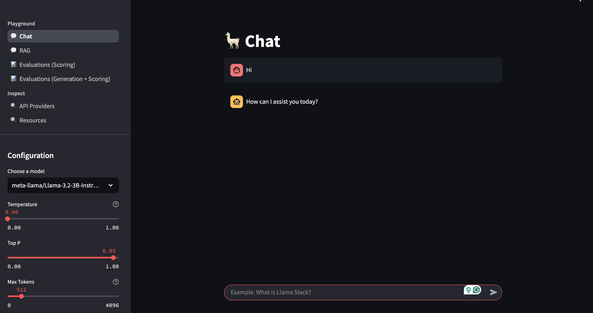

# LLaMA Stack RAG Deployment

This guide helps you deploy the **LLaMA Stack RAG UI** on an OpenShift cluster using Helm.


## Prerequisites

Before deploying, make sure you have the following:

- Access to an **OpenShift** cluster with appropriate permissions.
- NFD Operator and NVIDIA-GPU operator installed
- Two GPU nodes, one for vLLM and the other for Safety Model(A10 nodes)
- The label - you can have any label on the node and pass it as part of the parameter to the deploy script. Please refer `deploy.sh`.
- Helm is installed

## Modelcars
We deploy models using modelcars. To build modelcars for specific models, a valid Hugging Face token is needed and used with `modelcars/Containerfile` as follows:

```bash
podman build modelcars --build-arg=HF_TOKEN=${HF_TOKEN} --build-arg=MODEL_ID=meta-llama/Llama-3.2-3B-Instruct -t quay.io/username/modelcars:llama-3.2-3b-instruct
podman push quay.io/username/modelcars:llama-3.2-3b-instruct
```

Modelcars for `llama-3.2-3b-instruct` and `llama-guard-3-8b` have already been built and will be used by default when deploying using the steps described below.

## Pre-deployment Steps
In case you have a fresh cluster -
1. Install NFD Operator from OperatorHub
2. Create default instance(no change needed)
3. Validate in the GPU nodes if you have required `10de` labels in place
4. Install NVIDIA-GPU operator and create the ClusterPolicy(default)

This will set your cluster to use the provided GPUs and you can move forward to deploying AI workloads.

## Deployment Steps

1. Prior to deploying, ensure that you have access to the meta-llama/Llama-3.2-3B-Instruct model. If not, you can visit this meta and get access - https://www.llama.com/llama-downloads/

2. Once everything's set, navigate to the Helm deployment directory:

   ```bash
   cd deploy/helm
   ```

3. Run the install command:

   ```bash
   make install NAMESPACE=llama-stack-rag
   ```

   The script will:

   - Create a new project: `llama-stack-rag`
   - Deploy the Helm chart with toleration settings
   - Output the status of the deployment


## Post-deployment Verification

Once deployed, verify the following:

```bash
kubectl get pods -n llama-stack-rag

kubectl get svc -n llama-stack-rag

kubectl get routes -n llama-stack-rag
```

You should see the running components, services, and exposed routes.

## Resource cleanup

```
make uninstall NAMESPACE=llama-stack-rag
```

LLama UI

